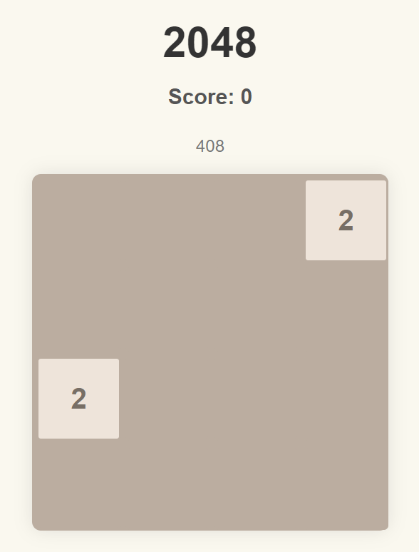
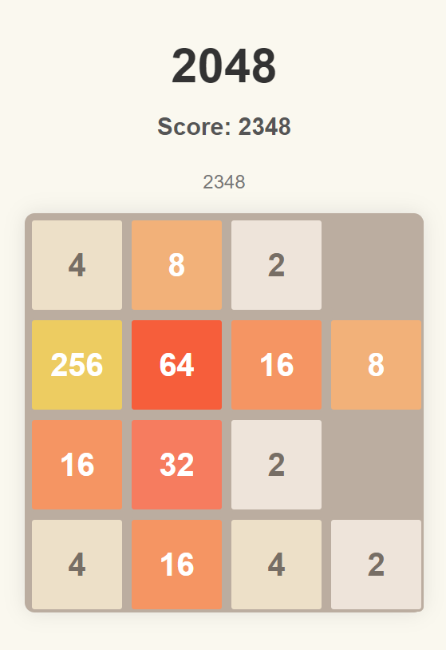
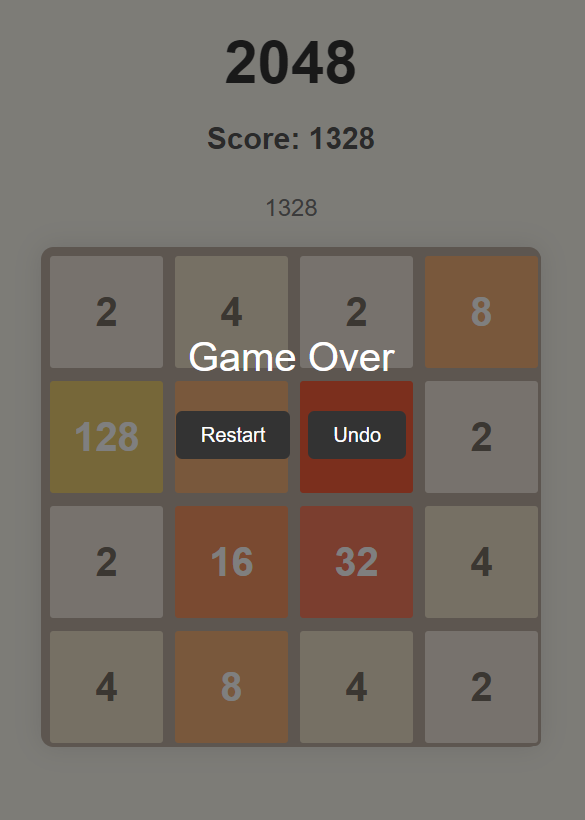

# 2048 Game

A simple and classic 2048 game implemented using HTML, CSS, and JavaScript. This game is designed to be played in your web browser.

## Features

- **Gameplay**: Use arrow keys to move tiles and combine them to reach the 2048 tile.
- **Score Tracking**: Displays the current score and high score.
- **Undo Function**: Allows you to undo the last move.
- **Restart Game**: Provides an option to restart the game at any time.
- **Responsive Design**: The game board adapts to different screen sizes.

## Project Structure

- `index.html`: The main HTML file for the game.
- `styles.css`: The stylesheet that defines the game's appearance.
- `script.js`: The JavaScript file that contains the game's logic.

## How to Play

- **Move Tiles**: Use the arrow keys on your keyboard to move the tiles in the respective directions.
- **Combine Tiles**: Tiles with the same number will combine into one when moved together.
- **Goal**: Reach the 2048 tile to win the game!

## Screenshots

## Troubleshooting

- **Game Not Starting**: Ensure that you are using a modern web browser and that JavaScript is enabled.
- **Tiles Not Moving**: Refresh the page and ensure that your keyboard is functioning correctly.

## Acknowledgments

- The 2048 game was originally developed by Gabriele Cirulli.
- Thanks to the open-source community for their contributions and resources.

